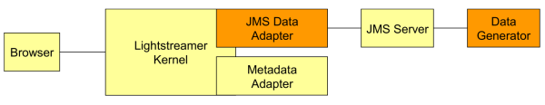
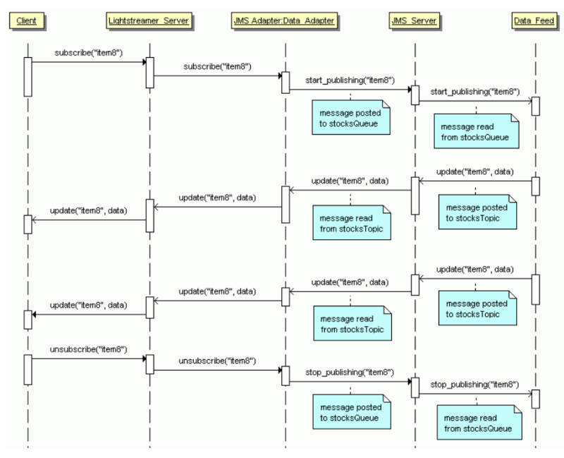

# Lightstreamer - Stock-List Demo - Java (JMS) Adapter #
<!-- START DESCRIPTION lightstreamer-example-stocklist-adapter-jms -->

This example shows how to integrate Lightstreamer Server with a JMS (Java Message Service) data feed.<br>
<b>For a more comprehensive solution, a separate product exists: the Lightstreamer JMS Gateway, which offers full-blown JMS APIs for JavaScript and other languages and does not require any server-side coding.</b><br>
For any inquiry, please email info@lightstreamer.com.

This application is the same as the [Lighstreamer - Basic Stock-List Demo - HTML Client](https://github.com/Weswit/Lightstreamer-example-Stocklist-client-javascript#basic-stock-list-demo---html-client), with the difference that the market-data-feed simulator is an external process that communicates with the Lightstreamer Data Adapter through JMS.
So, the goal of this demo is to show how a Lightstreamer Data Adapter can obtain data from an external source through JMS middleware. Both the Data Generator (feed process) and the Data Adapter source code are provided in this project.

## The Architecture ##

<br>

Referring to a Web-based scenario, the browser gets the static part of the page from a Web server, then connects to Lightstreamer Server to subscribe to the real-time updates. The Data Generator is a stand-alone process that simulates a data feed; it generates market prices for a set of stocks and
publishes this data, on demand, over JMS. The JMS Data Adapter communicates with the Data Generator through a JMS Server.<br>
The orange components in the architecture diagram above are provided as part of this example.<br>

The sequence diagram below shows a typical interaction between the components of the architecture. Notice that the method and message names are purely symbolic and are not directly referred to the APIs used in the source code.

<br>

The workflow of the application is the following:
- The Browser retrieves the static web resources from a Web server (that could be Lightstreamer internal web server) and initiates a push session with Lightstreamer Server.
- The Data Adapter, in its subscribe() method implementation, sends a message to a JMS queue in order to request the generator to start publishing the real-time data for a certain item.
- The Data Generator reads a requests from the queue and publishes to a JMS topic the current values for the subscribed item (i.e. snapshot) and any subsequent updates.
- The Data Adapter receives updates through the JMS topic and injects them into the Lightstreamer Kernel which in turn sends them to clients.<br>

<i>NOTE: To keep the code simple and clear, the demo does not include advanced fail-over and recovery mechanisms in the communication between the Adapter and the Generator.</i>

## Dig the Code ##

The "src" folder contais:
- src_adapter: contains the source code for the JMS Stock-List Demo Data Adapter. It can be referred to as a basic example for the development of Data Adapters based on Java Message Service (JMS).
- src_generator: contains the source code for the Generator.
- src_commons: contains the source code for classes that are used by both the Adapter and the Generator.

The "lib" folder should contain all the libraries needed for the Adapter recompilation; this includes:
- Lightstreamer java interface library;
- log4j library, used for the Adapter's own logging.

See the source code comments for further details.

The Metadata Adapter functionalities are absolved by the `LiteralBasedProvider` in [Lightstreamer - Reusable Metadata Adapters - Java Adapter](https://github.com/Weswit/Lightstreamer-example-ReusableMetadata-adapter-java), a simple full implementation of a Metadata Adapter, made available in Lightstreamer distribution. 

The project is comprised of source code and a deployment example. 

<!-- END DESCRIPTION lightstreamer-example-stocklist-adapter-jms -->

## JMS Setup ##

This demo needs a JMS infrastructure to run. You can choose whatever JMS middleware you prefer. In this example we will refer to [TIBCO Enterprise Message Service(TM)](http://www.tibco.com/products/automation/messaging/enterprise-messaging/enterprise-message-service/default.jsp), [JBossMQ](https://community.jboss.org/wiki/JBossMQ), and [JBoss Messaging](https://community.jboss.org/wiki/JBossMessaging).<br>
Please download and install the JMS software, then: 

### With TIBCO EMS ###
1. Create one topic and one queue. Open the queues.conf and topics.conf located under EMSHome/bin/ and append a line containing respectively "stocksQueue" and "stocksTopic" (without apexes).
2. Look for "jms.jar" and "tibjms.jar" from EMSHome/clients/java. You will need to copy them when deploying the Adapter and the Generator.

### With JBossMQ ###
1. Create one topic and one queue. Open the jbossmq-destinations-service.xml file located under /JBossHome/server/default/deploy/jms/ and add two mbean elements as shown below:

```xml
<mbean code="org.jboss.mq.server.jmx.Topic" name="jboss.mq.destination:service=Topic,name=stocksTopic">
  <depends optional-attribute-name="DestinationManager">
    jboss.mq:service=DestinationManager
  </depends>
</mbean>
<mbean code="org.jboss.mq.server.jmx.Queue" name="jboss.mq.destination:service=Queue,name=stocksQueue">
  <depends optional-attribute-name="DestinationManager">
    jboss.mq:service=DestinationManager
  </depends>
</mbean>
```
2. Look for "jms.jar" and "jbossmq-client.jar" from JBossHome/client/. You will need to copy them when deploying the Adapter and the Generator.

### With JBoss Messaging ###
1. Create one topic and one queue. Open the destinations-service.xml file located under /JBossHome/server/default/deploy/jboss-messaging.sar and add two mbean elements as shown below:

```xml
<mbean code="org.jboss.jms.server.destination.TopicService" name="jboss.messaging.destination:service=Topic,name=stocksTopic" xmbean-dd="xmdesc/Topic-xmbean.xml">
  <depends optional-attribute-name="ServerPeer">
    jboss.messaging:service=ServerPeer</depends>
  <depends>jboss.messaging:service=PostOffice</depends>
</mbean>
<mbean code="org.jboss.jms.server.destination.QueueService" name="jboss.messaging.destination:service=Queue,name=stocksQueue" xmbean-dd="xmdesc/Queue-xmbean.xml">
  <depends optional-attribute-name="ServerPeer">
    jboss.messaging:service=ServerPeer</depends>
  <depends>jboss.messaging:service=PostOffice</depends>
</mbean>
```

2. Look for "javassist.jar", "jbossall-client.jar", "jboss-messaging-client.jar", "jnpserver.jar" and "trove.jar" from /JBossHome/client/. Look for "jboss-aop-jdk50.jar" from /JBossHome/server/default/deploy/jboss-aop-jdk50.deployer/. Download the JMS SDK from
Sun's website and look for jms.jar in the lib folder. You will need to copy them when deploying the Adapter and the Generator.

<i>NOTE: from here on, this readme will refer to "tibjms.jar", "jbossall-client.jar" or the set of jars needed for JBoss Messaging as "customjmsjar.jar".</i>

# Build #

If you want to skip the build process of this Adapter please note that in the [deploy release](https://github.com/Weswit/Lightstreamer-example-StockList-adapter-jms/releases) of this project you can find the "deploy.zip" file that contains a ready-made deployment resource for the Lightstreamer server.<br>
Otherwise follow these steps:

* Get the ls-adapter-interface.jar and log4j-1.2.15.jar files from the [latest Lightstreamer distribution](http://www.lightstreamer.com/download) and put these files into lib folder.
* Create the jars StockQuotesGeneratorJMS.jar and LS_StockListJMS_DataAdapter.jar created by something like these commands
```sh
 >javac -source 1.7 -target 1.7 -nowarn -g -classpath lib/log4j-1.2.15.jar;lib/ls-adapter-interface.jar;jms.jar;customjmsjar.jar -sourcepath src/src_adapter;src/src_commons -d tmp_classes src/src_adapter/stocklist_jms_demo/adapters/StockQuotesJMSDataAdapter.java
 
 >jar cvf LS_StockListJMS_DataAdapter.jar -C tmp_classes src_adapter
 
 >javac -source 1.7 -target 1.7 -nowarn -g -classpath lib/log4j-1.2.15.jar;jms.jar;customjmsjar.jar -sourcepath src/src_standalone_generator -d tmp_classes src/src_standalone_generator/stocklist_jms_demo/feed_simulator/Generator.java
 
 >jar cvf StockQuotesGeneratorJMS -C tmp_classes src_standalone_generator
```

# Deploy #

Now you are ready to deploy the Stock-List Demo Adapter into Lighstreamer server. 
After you have Downloaded and installed Lightstreamer, please go to the "adapters" folder of your Lightstreamer Server installation.

You have to create a specific folder to deploy the Stock-List Adapter otherwise get the ready-made "StockQuotesJMSAdapter" deploy folder from "deploy.zip" of the [latest release](https://github.com/Weswit/Lightstreamer-example-StockList-adapter-jms/releases) of this project and skips the next three steps.<br>

1. You have to create a new folder, let's call it "StockQuotesJMSAdapter", and a "lib" folder inside it.
2. Create an "adapters.xml" file inside the "StockQuotesJMSAdapter" folder and use the following content (this is an example configuration, you can modify it to your liking):

```xml
<?xml version="1.0"?>

<adapters_conf id="STOCKLISTDEMO_JMS">


    <metadata_provider>

        <adapter_class>com.lightstreamer.adapters.metadata.LiteralBasedProvider</adapter_class>

        <!-- Optional.
             See LiteralBasedProvider javadoc. -->
        <param name="item_family_1">item.*</param>
        <param name="modes_for_item_family_1">MERGE</param>

    </metadata_provider>


    <data_provider name="QUOTE_ADAPTER">

        <adapter_class>stocklist_jms_demo.adapters.StockQuotesJMSDataAdapter</adapter_class>

        <!-- Optional parameters managed by StockQuotesJMSDataAdapter -->

        <param name="msgPoolSize">15</param>
        <param name="recoveryPauseMillis">2000</param>

        <!-- Configuration file for the Adapter's own logging.
             Logging is managed through log4j. -->
        <param name="log_config">adapters_log_conf.xml</param>
        <param name="log_config_refresh_seconds">10</param>

        <!-- JBoss Messaging example configuration -->

        <param name="jmsUrl">jnp://localhost:1099</param>
        <param name="initialContextFactory">org.jnp.interfaces.NamingContextFactory</param>
        <param name="topicConnectionFactory">ConnectionFactory</param>
        <param name="queueConnectionFactory">ConnectionFactory</param>
        <param name="topicName">topic/stocksTopic</param>
        <param name="queueName">queue/stocksQueue</param>

        <!--EMS example configuration -->
        <!--
        <param name="jmsUrl">tcp://localhost:7222</param>
        <param name="initialContextFactory">com.tibco.tibjms.naming.TibjmsInitialContextFactory</param>
        <param name="topicConnectionFactory">TopicConnectionFactory</param>
        <param name="queueConnectionFactory">QueueConnectionFactory</param>
        <param name="topicName">stocksTopic</param>
        <param name="queueName">stocksQueue</param>
        -->

    </data_provider>


</adapters_conf>
```
<br>
3. Copy into /StockQuotesJMSAdapter/lib the LS_StockListJMS_DataAdapter.jar jar created in the previous section.

Now your  JMS Stock-List Demo Adapter is ready to be deployed in the Lightstreamer server, please follow these steps:

1. Make sure you have installed Lightstreamer Server, as explained in the GETTING_STARTED.TXT file in the installation home directory.
2. Make sure that Lightstreamer Server is not running.
3. Copy the "StockQuotesJMSAdapter" directory and all of its files from this directory to the "adapters" subdirectory in your Lightstreamer Server installation home directory.
4. Copy the "jms.jar" and "customjmsjar.jar" files under "StockQuotesJMSAdapter/lib" (or under "Lightstreamer/shared/lib" if you think that those jars will be used by other Adapters too).
5. Copy the "ls-generic-adapters.jar" file from the "lib" directory of the sibling "Reusable_MetadataAdapters" SDK example to the "shared/lib"  subdirectory in your Lightstreamer Server installation home directory.
6. Open and configure "StockQuotesJMSAdapter/adapters.xml" as done with the Generator configuration file (except this is an xml file while the other is a property file). You can also configure the logging category of the Adapter in "StockQuotesJMSAdapter/adapters_log_conf.xml".
7. Lightstreamer Server is now ready to be launched.

## Deployment of Generator Component ##

The instructions provided refer to the "Deployment_Generator" directory you can find in the "deploy.zip" file of [latest release](https://github.com/Weswit/Lightstreamer-example-StockList-adapter-jms/releases).<br>

1. Copy the contents of the Generator folder to any folder  in your file system and put "jms.jar" and "customjmsjar.jar" under its lib subfolder.
2. Configure the launch script start_generator.bat (or start_generator.sh if you are under Unix) setting the GENERATOR_HOME (the path of the  folder), the JAVA_HOME (path of a JRE/JDK) and CONF_FILE (the path of a configuration file) variables.
3. Create your configuration file. The included test.conf file shows all available parameters. Note that most parameters are required (you can omit msgPoolSize and recoveryPauseMillis).
4. Create a log4j configuration file (see log.xml as an Example). The category used by the Generator is SLGenerator.


<br>
Please test your Adapter with one of the clients in this [list](https://github.com/Weswit/Lightstreamer-example-StockList-adapter-jms#clients-using-this-adapter).<br>

In order to make the StockListDemo front-end pages consult the newly installed Adapter Set, you need to modify the front-end pages and set the required Adapter Set name to STOCKLISTDEMO_JMS when creating the LightstreamerClient instance. So a line like this:
```js
var sharingClient = new LightstreamerClient(hostToUse,"DEMO");
```
becomes like this:
```js
var sharingClient = new LightstreamerClient(hostToUse,"STOCKLISTDEMO_JMS");
  ```
(Note: you don't need to reconfigure the Data Adapter name, as it is the same in both Adapter Sets).

Moreover, as the referred Adapter Set has changed, make sure that the front-end does no longer share the Connection with other demos.
So a line like this:
```js
sharingClient.connectionSharing.enableSharing("DemoCommonConnection","ls/","SHARE_SESSION", true);
```
should become like this:
```js
sharingClient.connectionSharing.enableSharing("JMSStockListConnection","ls/","SHARE_SESSION", true);
```
The StockListDemo web front-end is now ready to be opened. The front-end will now get data from the newly installed Adapter Set.

# See Also #

## Clients Using This Adapter ##

<!-- START RELATED_ENTRIES -->

* [Lightstreamer - Stock-List Demos - HTML Clients](https://github.com/Weswit/Lightstreamer-example-Stocklist-client-javascript)

<!-- END RELATED_ENTRIES -->
## Related Projects ##
* [Lightstreamer - Reusable Metadata Adapters - Java Adapter](https://github.com/Weswit/Lightstreamer-example-ReusableMetadata-adapter-java)
* [Lightstreamer - Portfolio Demo - Java Adapter](https://github.com/Weswit/Lightstreamer-example-Portfolio-adapter-java)

## The Same Demo Adapter With Other Technologies ##
* [Lightstreamer - Stock-List Demo - Java Adapter](https://github.com/Weswit/Lightstreamer-example-StockList-adapter-java)
* [Lightstreamer - Stock-List Demo - .NET Adapter](https://github.com/Weswit/Lightstreamer-example-StockList-adapter-dotnet)

# Lightstreamer Compatibility Notes #

- Compatible with Lightstreamer SDK for Java Adapters since 5.1
