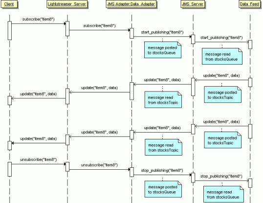

# Lightstreamer - Stock-List Demo - Java (JMS) Adapter

<!-- START DESCRIPTION lightstreamer-example-stocklist-adapter-jms -->

This example shows how to integrate Lightstreamer Server with a <b>JMS (Java Message Service)</b> data feed.<br>
<b>For a more comprehensive solution, a separate product exists: [Lightstreamer JMS Extender](http://www.lightstreamer.com/ls-jms-features), which offers full-blown JMS APIs for JavaScript and other languages and does not require any server-side coding.</b><br>

## Details

This application is the same as the [Lighstreamer - Basic Stock-List Demo - HTML Client](https://github.com/Lightstreamer/Lightstreamer-example-Stocklist-client-javascript#basic-stock-list-demo---html-client), with the difference that the market-data-feed simulator is an external process that communicates with the Lightstreamer Data Adapter through JMS.
So, the goal of this demo is to show how a Lightstreamer Data Adapter can obtain data from an external source through JMS middleware. Both the Data Generator (feed process) and the Data Adapter source code are provided in this project.

### The Architecture

<br>

Referring to a Web-based scenario, the browser gets the static part of the page from a Web server, then connects to Lightstreamer Server to subscribe to the real-time updates. The Data Generator is a stand-alone process that simulates a data feed; it generates market prices for a set of stocks and
publishes this data, on demand, over JMS. The JMS Data Adapter communicates with the Data Generator through a JMS Server.<br>
The orange components in the architecture diagram above are provided as part of this example.<br>

The sequence diagram below shows a typical interaction between the components of the architecture. Notice that the method and message names are purely symbolic and are not directly referred to the APIs used in the source code.

<br>

The workflow of the application is the following:
* The Browser retrieves the static web resources from a Web server (that could be Lightstreamer internal web server) and initiates a push session with Lightstreamer Server.
* The Data Adapter, in its subscribe() method implementation, sends a message to a JMS queue to request the generator to start publishing the real-time data for a certain item.
* The Data Generator reads a requests from the queue and publishes to a JMS topic the current values for the subscribed item (i.e., snapshot) and any subsequent updates.
* The Data Adapter receives updates through the JMS topic and injects them into the Lightstreamer Kernel, which, in turn, sends them to clients.<br>

<i>NOTE: To keep the code simple and clear, the demo does not include advanced fail-over and recovery mechanisms in the communication between the Adapter and the Generator.</i>

### Dig the Code

The `src` folder contains:
* `adapters`: contains the source code for the JMS Stock-List Demo Data Adapter. It can be referred to as a basic example for the development of Data Adapters based on Java Message Service (JMS).
* `feed_simulator`: contains the source code for the Generator.
* `common`: contains the source code for classes used by both the Adapter and the Generator.

See the source code comments for further details.

The Metadata Adapter functionalities are absolved by the `LiteralBasedProvider` in [Lightstreamer Java In-Process Adapter SDK](https://github.com/Lightstreamer/Lightstreamer-lib-adapter-java-inprocess#literalbasedprovider-metadata-adapter), a simple full implementation of a Metadata Adapter, already provided by Lightstreamer server. 

### The Adapter Set Configuration
This Adapter Set Name is configured and will be referenced by the clients as `STOCKLISTDEMO_JMS`.

The `adapters.xml` file for this demo should look like:
```xml   
<?xml version="1.0"?>

<adapters_conf id="STOCKLISTDEMO_JMS">


    <metadata_provider>

        <adapter_class>com.lightstreamer.adapters.metadata.LiteralBasedProvider</adapter_class>

        <!-- Optional.
             See LiteralBasedProvider javadoc. -->
        <param name="item_family_1">item.*</param>
        <param name="modes_for_item_family_1">MERGE</param>

    </metadata_provider>


    <data_provider name="QUOTE_ADAPTER">

        <adapter_class>stocklist_jms_demo.adapters.StockQuotesJMSDataAdapter</adapter_class>

        <!-- Optional parameters managed by StockQuotesJMSDataAdapter -->

        <param name="msgPoolSize">15</param>
        <param name="recoveryPauseMillis">2000</param>

        <!-- ActiveMQ example configuration -->

        <param name="jmsUrl">tcp://localhost:61616</param>
        <param name="initialContextFactory">org.apache.activemq.jndi.ActiveMQInitialContextFactory</param>
        <param name="topicConnectionFactory">connectionFactory</param>
        <param name="queueConnectionFactory">connectionFactory</param>
        <param name="topicName">stocksTopic</param>
        <param name="queueName">stocksQueue</param>

        <!--EMS example configuration -->
        <!--
        <param name="jmsUrl">tcp://localhost:7222</param>
        <param name="initialContextFactory">com.tibco.tibjms.naming.TibjmsInitialContextFactory</param>
        <param name="topicConnectionFactory">TopicConnectionFactory</param>
        <param name="queueConnectionFactory">QueueConnectionFactory</param>
        <param name="topicName">stocksTopic</param>
        <param name="queueName">stocksQueue</param>
        -->

    </data_provider>


</adapters_conf>
```

<i>NOTE: not all configuration options of an Adapter Set are exposed by the file suggested above. 
You can easily expand your configurations using the generic template, see the [Java In-Process Adapter Interface Project](https://github.com/Lightstreamer/Lightstreamer-lib-adapter-java-inprocess#configuration) for details.</i><br>
<br>
Please refer [here](https://lightstreamer.com/docs/ls-server/latest/General%20Concepts.pdf) for more details about Lightstreamer Adapters.


The project is comprised of source code and a deployment example. 

<!-- END DESCRIPTION lightstreamer-example-stocklist-adapter-jms -->

## Install

### JMS Setup

This demo needs a JMS infrastructure to run. You can choose whatever JMS middleware you prefer. In this example, we will refer to [Apache ActiveMQ (TM)](http://activemq.apache.org/components/classic/).<br>
Please download and install the JMS software, and make sure it is properly active in your environment before launching the demo.

### Adapter Setup

If you want to install a version of this Adapter in your local environment, follow these steps:

* Download the `deploy.zip` file that you can find in the [deploy release](https://github.com/Lightstreamer/Lightstreamer-example-StockList-adapter-JMS/releases) of this project and extract the `Deployment_LS/StockQuotesJMSAdapter` folder.
* Make sure you have installed [Lightstreamer Server](https://lightstreamer.com/download/), as explained in the `GETTING_STARTED.TXT` file in the installation home directory.
* Make sure that Lightstreamer Server is not running.
* Copy the `StockQuotesJMSAdapter` directory and all of its files from this directory to the `adapters` subdirectory in your Lightstreamer Server installation home directory.
* [Optional] Customize logging settings in log4j configuration file `StockQuotesJMSAdapter/classes/log4j2.xml`.
* Open and configure `StockQuotesJMSAdapter/adapters.xml` as done with the Generator configuration file (except this is an xml file while the other is a property file).
* Consider to add the env property "-Dorg.apache.activemq.SERIALIZABLE_PACKAGES=*" to the Lightstreamer Server launch script.
* Lightstreamer Server is now ready to be launched.

### Generator Setup

* Download the `deploy.zip` file that you can find in the [deploy release](https://github.com/Lightstreamer/Lightstreamer-example-StockList-adapter-JMS/releases) of this project and extract the `Deployment_Generator` folder.
* Configure the launch script `start_generator.bat` (or `start_generator.sh` if you are under Unix) setting the GENERATOR_HOME (the path of the folder), the JAVA_HOME (path of a JRE/JDK) and CONF_FILE (the path of a configuration file) variables.
* Create your configuration file. The `included test.conf` file shows all available parameters. Note that most parameters are required (you can omit msgPoolSize and recoveryPauseMillis).
* [Optional] Customize logging settings in log4j configuration file (see `log4j2.xml` as an Example). The category used by the Generator is SLGenerator.

### Start the client

Please test your Adapter with one of the clients in this [list](https://github.com/Lightstreamer/Lightstreamer-example-StockList-adapter-jms#clients-using-this-adapter).<br>

To make the StockListDemo front-end pages consult the newly installed Adapter Set, you need to modify the front-end pages and set the required Adapter Set name to STOCKLISTDEMO_JMS when creating the LightstreamerClient instance. So a line like this:
```js
var sharingClient = new LightstreamerClient(hostToUse,"DEMO");
```
becomes like this:
```js
var sharingClient = new LightstreamerClient(hostToUse,"STOCKLISTDEMO_JMS");
  ```
(Note: you don't need to reconfigure the Data Adapter name, as it is the same in both Adapter Sets).

Moreover, as the referred Adapter Set has changed, make sure that the front-end no longer shares the Connection with other demos.
So a line like this:
```js
sharingClient.connectionSharing.enableSharing("DemoCommonConnection","ls/","SHARE_SESSION", true);
```
should become like this:
```js
sharingClient.connectionSharing.enableSharing("JMSStockListConnection","ls/","SHARE_SESSION", true);
```
The StockListDemo web front-end is now ready to be opened. The front-end will now get data from the newly installed Adapter Set.

## Build

To build your own version of `example-StockList-JMS-adapter-java-0.0.1-SNAPSHOT.jar`, instead of using the ones provided in the `deploy.zip` file from the Install section above, you have two options:
either use [Maven](https://maven.apache.org/) (or other build tools) to take care of dependencies and building (recommended) or gather the necessary jars yourself and build it manually.
For the sake of simplicity only the Maven case is detailed here.

### Maven

You can easily build and run this application using Maven through the pom.xml file located in the root folder of this project. As an alternative, you can use an alternative build tool (e.g. Gradle, Ivy, etc.) by converting the provided pom.xml file.

Assuming Maven is installed and available in your path, and added the dependency to the chosen jms to the pom.xml, in the case of ActiveMQ this new entry will be needed in the dependencies:  

```xml
<!-- https://mvnrepository.com/artifact/org.apache.activemq/activemq-client -->
<dependency>
    <groupId>org.apache.activemq</groupId>
    <artifactId>activemq-client</artifactId>
    <version>5.16.0</version>
</dependency>
```

you can build the demo by running

```sh 
 mvn install dependency:copy-dependencies 
```

## See Also

### Clients Using This Adapter

* [Lightstreamer - Stock-List Demos - HTML Clients](https://github.com/Lightstreamer/Lightstreamer-example-Stocklist-client-javascript)

### Related Projects
* [LiteralBasedProvider Metadata Adapter](https://github.com/Lightstreamer/Lightstreamer-lib-adapter-java-inprocess#literalbasedprovider-metadata-adapter)
* [Lightstreamer - Portfolio Demo - Java Adapter](https://github.com/Lightstreamer/Lightstreamer-example-Portfolio-adapter-java)

### The Same Demo Adapter With Other Technologies
* [Lightstreamer - Stock-List Demo - Java Adapter](https://github.com/Lightstreamer/Lightstreamer-example-StockList-adapter-java)
* [Lightstreamer - Stock-List Demo - .NET Adapter](https://github.com/Lightstreamer/Lightstreamer-example-StockList-adapter-dotnet)

## Lightstreamer Compatibility Notes

* Compatible with Lightstreamer SDK for Java In-Process Adapters since 7.3.
* For a version of this example compatible with Lightstreamer SDK for Java In-Process Adapters 6.0, please refer to [this tag](https://github.com/Lightstreamer/Lightstreamer-example-StockList-adapter-JMS/tree/pre_mvn).
* For a version of this example compatible with Lightstreamer SDK for Java In-Process Adapters 5.1, please refer to [this tag](https://github.com/Lightstreamer/Lightstreamer-example-StockList-adapter-JMS/tree/for_Lightstreamer_5.1).
